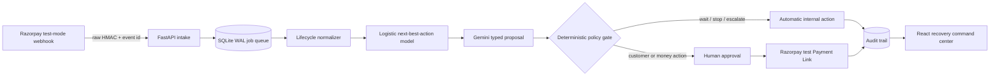

# PayMender

> Working codename for a policy-gated AI subscription revenue-recovery command center, built for Track 03 of the Razorpay AI Buildathon.

PayMender detects failed recurring payments, estimates the net value of each permitted intervention, asks Gemini for a typed explanation and customer-safe message preview, then applies deterministic policy gates before anything can execute. Money-adjacent actions require explicit operator approval. Every proposal, override, approval, failure and result is written to an audit trail.

The repository is designed to be cloned and demonstrated without paid infrastructure. It starts with synthetic customer data and safe demo adapters; Razorpay and Gemini activate only when test credentials are supplied locally.

## What judges can verify

- `subscription.pending`, `subscription.halted`, `subscription.charged` and `payment_link.paid` webhook normalization.
- Raw-body HMAC verification and `x-razorpay-event-id` duplicate suppression.
- A learned next-best-action model with transparent expected-value scoring.
- Gemini structured proposals that have **no execution authority**.
- Hard contact caps, amount floors, lifecycle rules and exactly-once link creation.
- Explicit human approval before Payment Link creation or customer-outreach finalization.
- Ten reproducible held-out batches compared against three baselines.
- Failure injection for duplicate webhooks, model quota, Razorpay 5xx and worker crashes.

## Architecture



The React production build is served by the same FastAPI process. SQLite WAL is the authoritative local-demo store; the database queue retains failed jobs and reclaims expired leases.

More detail: [ARCHITECTURE.md](docs/ARCHITECTURE.md) · [EVALUATION.md](docs/EVALUATION.md) · [DEMO.md](docs/DEMO.md) · [SECURITY.md](docs/SECURITY.md)

## Quick start

Prerequisites: Python 3.12+, Node.js 20+ and pnpm.

```powershell
Copy-Item .env.example .env.local

python -m venv .venv
.\.venv\Scripts\Activate.ps1
python -m pip install -r backend\requirements-dev.txt

Set-Location frontend
pnpm install
pnpm build
Set-Location ..

python -m uvicorn app.main:app --app-dir backend --reload --port 8000
```

Open `http://127.0.0.1:8000`, then paste the `OPERATOR_API_TOKEN` from `.env.local` into the protected operator screen. API documentation is available at `/api/docs`.

For separate hot-reload servers:

```powershell
# Terminal 1
python -m uvicorn app.main:app --app-dir backend --reload --port 8000

# Terminal 2
Set-Location frontend
pnpm dev
```

Open `http://127.0.0.1:5173`.

## Credentials

Keep credentials only in ignored `.env.local`. Never paste secrets into issues, commits, screenshots or pitch-video terminals.

- `GEMINI_API_KEY`: activates typed Gemini proposals. Without it, the app uses audited deterministic templates.
- `RAZORPAY_KEY_ID` and `RAZORPAY_KEY_SECRET`: must be test-mode credentials; non-`rzp_test_` IDs are rejected at startup.
- `RAZORPAY_WEBHOOK_SECRET`: separate secret used to verify raw webhook bodies.
- `OPERATOR_API_TOKEN`: required local command-center credential; use a random value of at least 24 characters. It is held only in browser memory.
- `APP_DISPLAY_NAME`: changes the visible product name without changing internal recovery code.

No outbound SMS, email or WhatsApp integration exists. Generated messages are previews only.

## Test and verification

```powershell
python -m pytest backend\tests -q
Set-Location frontend
pnpm lint
pnpm build
```

The real sandbox demo should create at most five Payment Links even though the Razorpay test account permits more. The remaining evaluation is entirely synthetic and makes no production uplift claim.

## Scope and limitations

- Subscription recovery only; checkout abandonment and B2B collections are intentionally excluded.
- INR only in this MVP.
- Synthetic customer identities and outcomes only.
- Local SQLite is optimized for a reproducible judged demo, not multi-region production.
- A created Payment Link recovers a missed amount but does not itself reactivate the original subscription mandate.
- Only a matching `payment_link.paid` event is attributed to PayMender recovery; an ordinary recurring `subscription.charged` event is reported as organic resolution.
- Model probabilities are learned from a transparent simulator and must not be treated as real merchant estimates.

## License

[MIT](LICENSE)
