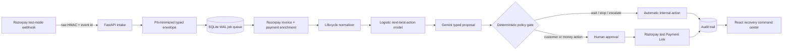

# PayMender

> Working codename for a policy-gated AI subscription revenue-recovery command center, built for Track 03 of the Razorpay AI Buildathon.

PayMender detects failed recurring payments, estimates the net value of each permitted intervention, asks Gemini for a typed explanation and customer-safe message preview, then applies deterministic policy gates before anything can execute. Money-adjacent actions require explicit operator approval. Within each evidence run, every proposal, override, approval, failure and result is appended to the audit history; the explicit synthetic reset starts a new run.

The repository is designed to be cloned and demonstrated without paid infrastructure. It has two explicit modes: a synthetic evidence mode for repeatable evaluation and a Razorpay test mode for the genuine webhook-to-recovery loop. The two sources are isolated in the queue, metrics and audit views.

## What judges can verify

- Official subscription-only `subscription.pending`, `subscription.halted`, `subscription.charged`, `subscription.cancelled` and `subscription.completed` webhook intake.
- Asynchronous invoice and failed-payment enrichment from Razorpay test APIs when subscription events omit the amount.
- Raw-body HMAC verification and `x-razorpay-event-id` duplicate suppression.
- A learned next-best-action model with transparent expected-value scoring.
- Gemini structured proposals that have **no execution authority**.
- Hard contact caps, amount floors, lifecycle rules and exactly-once link creation.
- Explicit human approval before Payment Link creation or customer-outreach finalization.
- Ten reproducible held-out batches compared against three baselines.
- Failure injection for duplicate webhooks, model quota, Razorpay 5xx and worker crashes.

## Architecture



The React production build is served by the same FastAPI process. SQLite WAL is the authoritative local-demo store; the database queue retains failed jobs and reclaims expired leases.

Start with the [reviewer runbook](docs/REVIEWER_RUNBOOK.md). More detail: [ARCHITECTURE.md](docs/ARCHITECTURE.md) · [RAZORPAY_TEST_REHEARSAL.md](docs/RAZORPAY_TEST_REHEARSAL.md) · [EVALUATION.md](docs/EVALUATION.md) · [DEMO.md](docs/DEMO.md) · [SECURITY.md](docs/SECURITY.md)

## Quick start

Prerequisites: Python 3.12+, Node.js 20+ and pnpm.

```powershell
Copy-Item .env.example .env.local
.\scripts\Set-OperatorToken.ps1

python -m venv .venv
.\.venv\Scripts\Activate.ps1
python -m pip install -r backend\requirements-dev.txt

Set-Location frontend
pnpm install --frozen-lockfile --ignore-scripts
pnpm build
Set-Location ..

.\scripts\Start-PayMender.ps1
```

Open `http://127.0.0.1:8000`, then paste the `OPERATOR_API_TOKEN` from `.env.local` into the protected operator screen. API documentation is available at `/api/docs`.

The start script limits numerical-library worker threads to one. This keeps the local demo stable on memory-constrained Windows machines and does not change model output.

For separate hot-reload servers:

```powershell
# Terminal 1
python -m uvicorn app.main:app --app-dir backend --reload --port 8000

# Terminal 2
Set-Location frontend
pnpm dev
```

Open `http://127.0.0.1:5173`.

## Credentials

Keep credentials only in ignored `.env.local`. Never paste secrets into issues, commits, screenshots or pitch-video terminals.

- `GEMINI_API_KEY`: activates typed Gemini proposals. Without it, the app uses audited deterministic templates.
- `RAZORPAY_KEY_ID` and `RAZORPAY_KEY_SECRET`: must be test-mode credentials; non-`rzp_test_` IDs are rejected at startup.
- `RAZORPAY_WEBHOOK_SECRET`: separate secret used to verify raw webhook bodies.
- `OPERATOR_API_TOKEN`: required local command-center credential. `Set-OperatorToken.ps1` writes a 256-bit value into ignored `.env.local` without printing it; the UI holds it only in browser memory.
- `RAZORPAY_PAYMENT_LINK_HOSTS`: exact HTTPS hostname allowlist for returned Payment Links; defaults to `rzp.io`.
- `GEMINI_TIMEOUT_SECONDS` and `GEMINI_MAX_OUTPUT_TOKENS`: bound provider time and output consumption.
- `APP_DISPLAY_NAME`: changes the visible product name without changing internal recovery code.

No outbound SMS, email or WhatsApp integration exists. Generated messages are previews only.

## Choose the operating mode

`DEMO_MODE=true` seeds seven fictional cases and enables the Reliability Lab. It always forces network-isolated adapters, even if test credentials are present. Use this to explain the policy gates and run the reproducible evaluation.

`DEMO_MODE=false` starts with an empty Razorpay test queue, hides reset/failure injection controls and shows only `razorpay_test` cases and evidence. Signed webhooks must arrive through a temporary public HTTPS endpoint. Follow [the real test rehearsal](docs/RAZORPAY_TEST_REHEARSAL.md) before recording the submission video.

## Test and verification

```powershell
.\scripts\Verify-PayMender.ps1
```

Verification runs the full backend suite, frontend checks/build, dependency audits, tracked-secret scanning and four Playwright reviewer flows. The real sandbox demo should create at most five Payment Links even though the Razorpay test account permits more. The remaining evaluation is entirely synthetic and makes no production uplift claim.

## Scope and limitations

- Subscription recovery only; checkout abandonment and B2B collections are intentionally excluded.
- INR only in this MVP.
- Demo identities and held-out outcomes are synthetic; Razorpay test cases retain only anonymous subscription and provider references.
- Local SQLite is optimized for a reproducible judged demo, not multi-region production.
- A created Payment Link recovers a missed amount but does not itself reactivate the original subscription mandate.
- Only a matching `payment_link.paid` event is attributed to PayMender recovery; an ordinary recurring `subscription.charged` event is reported as organic resolution.
- Model probabilities are learned from a transparent simulator and must not be treated as real merchant estimates.

## License

[MIT](LICENSE)
